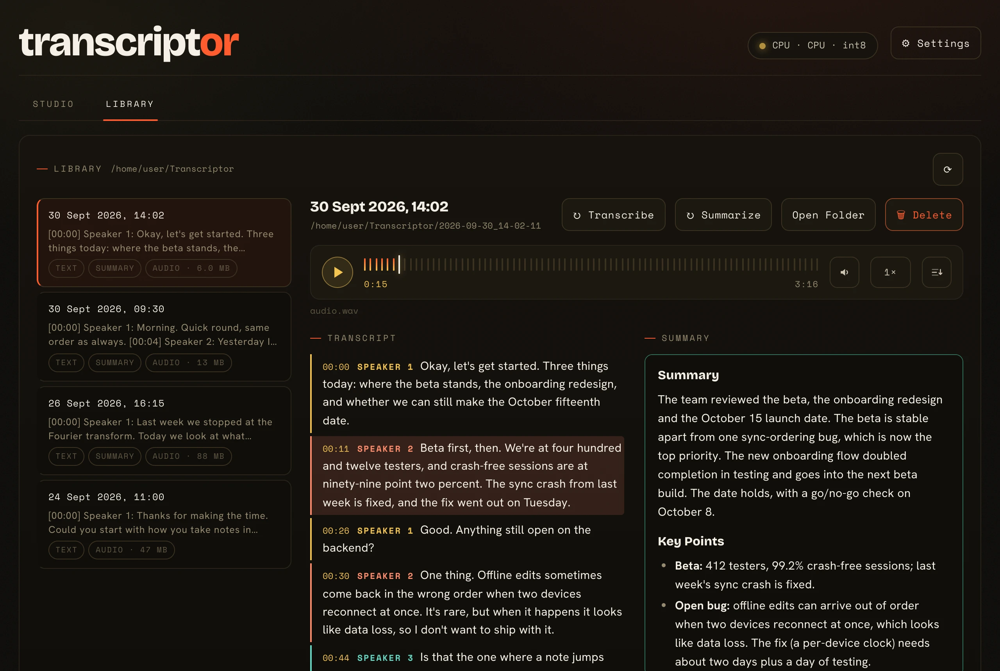
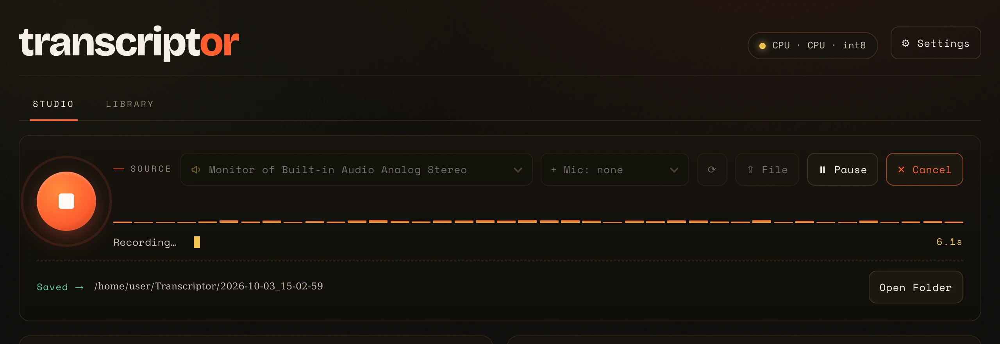

<h1 align="center">
  <picture>
    <source media="(prefers-color-scheme: dark)" srcset="assets/logo-wordmark.svg">
    
  </picture>
</h1>

<p align="center">
  Transcripts and summaries of meetings, lectures and interviews,<br>
  from one binary, without your audio ever leaving the machine.
</p>

<p align="center">
  <b>English</b> · <a href="README.tr.md">Türkçe</a>
</p>

<p align="center">
  <a href="https://github.com/shimadachi/transcriptor/releases"></a>
  <a href="LICENSE"></a>
  
  
</p>

<p align="center">
  
</p>

Transcribes and summarizes meetings, lectures, and interviews as **a single
local binary**. No install, no virtualenv, no external service; it produces a
directly runnable executable for Windows and macOS.

**Audio is never sent to any server; all processing is local.**

The app goes online for two things only. It downloads models: the ones you
pick in Settings, and the speaker-separation models the first time a recording
uses them. And once a day it asks GitHub whether a newer release exists, to
show a banner when one does. That check is on by default, carries nothing
about you or your recordings, and is switched off under Settings → General →
"Check GitHub for new releases".

## What it does

- **Records system audio or a microphone** — or both at once, mixed live with
  gain control and a peak limiter. It can also process an audio/video file you
  already have.
- **Transcribes** — whisper.cpp, with word-level timestamps.
- **Live transcript** — optional, switched on from the studio: the text appears
  while you record, from a lighter speech model chosen separately in
  Settings → General. When it heard the whole take it is kept as the
  transcript at Stop, with no second pass; one that missed part of the take is
  not, and the status line says why. **Transcribe** still runs the full model
  over the same audio, and separates speakers, which the live one never does.
  Keeping it can be switched off in Settings → General.
- **Separates speakers** — sherpa-onnx, labelling them "Speaker 1/2/3".
- **Summarizes** — embedded llama.cpp, following the note template you pick.
  Recordings too long for the context window are summarized in chunks and merged.
- **Note templates** — five built in (meeting, standup, lecture, interview,
  general) plus **your own**: name, system prompt, and persistent context.
- **Library** — a second tab listing every past session in the output folder,
  with its transcript, its summary, and a player for the saved audio.
- **Bilingual interface** — English / Turkish, remembered in `config.json`.
  Both the language and the light / dark theme live in Settings → General.

<p align="center">
  
</p>

## Components

| Layer | Used |
|---|---|
| Interface | HTML/CSS/JS in a **native window** (WebView2 / WKWebView / WebKitGTK) |
| STT | **whisper.cpp** (ggml) |
| Speaker separation | **sherpa-onnx** + the ONNX build of pyannote segmentation-3.0 |
| Summarizer | **Embedded llama.cpp** (optionally LM Studio / Ollama) |
| Audio capture | **miniaudio** (WASAPI / CoreAudio / PulseAudio) |
| HTTP | **cpp-httplib** |
| Distribution | **one binary**, web UI compiled in |

## Getting started

Packages for Linux, macOS and Windows, in CPU, CUDA, Vulkan and Metal variants,
are attached to every
[release](https://github.com/shimadachi/transcriptor/releases/latest). The CUDA
packages need the CUDA Toolkit installed;
[Building](https://github.com/shimadachi/transcriptor/wiki/Building) explains
which package to pick. To build from source instead:

```bash
cmake --preset linux && cmake --build --preset linux
```

The other presets, and what each one needs, are on the same page.

## Documentation

The full documentation is in the [wiki](https://github.com/shimadachi/transcriptor/wiki):

- **[Building](https://github.com/shimadachi/transcriptor/wiki/Building)** — requirements, presets, prebuilt packages, CUDA and Vulkan notes, build options
- **[Running](https://github.com/shimadachi/transcriptor/wiki/Running)** — command-line flags, the system tray, recording system audio on each platform
- **[Models](https://github.com/shimadachi/transcriptor/wiki/Models)** — speech, voice-detection, speaker and summarizer models, where they are kept, VRAM
- **[Using the app](https://github.com/shimadachi/transcriptor/wiki/Using-the-app)** — note templates, the Library, Settings, interface language, configuration
- **[Development](https://github.com/shimadachi/transcriptor/wiki/Development)** — upgrading the dependency pins, project layout

## License

[MIT](LICENSE) — © 2026 shimadachi.

Third-party components inside the compiled binary keep their own licenses:
llama.cpp and whisper.cpp (MIT), sherpa-onnx (Apache-2.0), ONNX Runtime (MIT),
miniaudio (MIT/Unlicense), cpp-httplib (MIT), nlohmann/json (MIT), webview
(MIT), Eigen (MPL-2.0), OpenFST (Apache-2.0).
