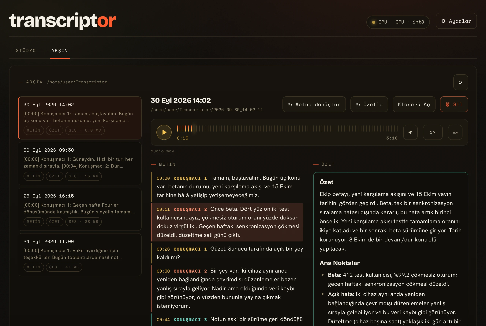
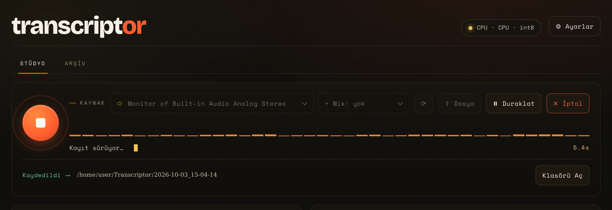

<h1 align="center">
  <picture>
    <source media="(prefers-color-scheme: dark)" srcset="assets/logo-wordmark.svg">
    
  </picture>
</h1>

<p align="center">
  Toplantı, ders ve görüşmelerin metni ve özeti,<br>
  tek bir binary'den, sesiniz bilgisayardan hiç çıkmadan.
</p>

<p align="center">
  <a href="README.md">English</a> · <b>Türkçe</b>
</p>

<p align="center">
  <a href="https://github.com/shimadachi/transcriptor/releases"></a>
  <a href="LICENSE"></a>
  
  
</p>

<p align="center">
  
</p>

Toplantı, ders ve görüşme kayıtlarını metne döken ve özetleyen **tek bir yerel
binary**. Kurulum, sanal ortam ya da harici bir servis gerekmez; Windows ve
macOS için doğrudan çalıştırılabilir dosya üretir.

**Ses hiçbir sunucuya gönderilmez; tüm işleme yereldir.**

Uygulama yalnızca iki iş için internete çıkar. Model indirir: Ayarlar'dan
seçtikleriniz ve konuşmacı ayrımı modelleri, bir kayıt onları ilk kez
kullandığında. Bir de günde bir kez GitHub'a daha yeni bir sürüm olup
olmadığını sorar ve varsa bir şerit gösterir. Bu denetim varsayılan olarak
açıktır, sizinle ya da kayıtlarınızla ilgili hiçbir şey taşımaz ve Ayarlar →
Genel → "Yeni sürümler için GitHub'a bak" ile kapatılır.

## Neler yapar

- **Sistem sesini ya da mikrofonu kaydeder** — ikisini aynı anda karıştırabilir
  (gerçek zamanlı kazanç + tepe sınırlayıcı). Elinizdeki bir ses/video dosyasını
  da işleyebilir.
- **Metne döker** — whisper.cpp, kelime bazlı zaman damgalarıyla.
- **Canlı metin** — isteğe bağlı, stüdyodan açılır: siz kaydederken metin
  belirir; bunun için Ayarlar → Genel'de ayrıca seçilen daha hafif bir konuşma
  modeli kullanılır. Kaydın tamamını duyduysa Durdur'da kaydın metni olarak
  saklanır, ikinci bir geçiş gerekmez; kaydın bir bölümünü kaçırdıysa saklanmaz
  ve durum satırı nedenini söyler. **Metne Dönüştür** aynı ses üzerinde tam
  modeli çalıştırmaya ve canlı metnin hiç yapmadığı konuşmacı ayrımına yine
  hazırdır. Saklama Ayarlar → Genel'den kapatılabilir.
- **Konuşmacıları ayırır** — sherpa-onnx; "Konuşmacı 1/2/3" olarak etiketler.
- **Özetler** — gömülü llama.cpp ile, seçtiğiniz not şablonuna göre. Uzun
  kayıtlar parça parça özetlenip birleştirilir.
- **Not şablonları** — beş hazır şablon (toplantı, standup, ders, görüşme,
  genel) ve **kendi şablonlarınız**: ad + sistem promptu + kalıcı bağlam.
- **Arşiv** — çıktı klasöründeki tüm eski oturumları listeleyen ikinci sekme;
  metni, özeti ve saklanmış sesi oynatıcısıyla birlikte gösterir.
- **İki dilli arayüz** — English / Türkçe, seçim `config.json`'da saklanır.
  Hem dil hem aydınlık/karanlık tema Ayarlar → Genel altındadır.

<p align="center">
  
</p>

## Bileşenler

| Katman | Kullanılan |
|---|---|
| Arayüz | HTML/CSS/JS, **native pencere** (WebView2 / WKWebView / WebKitGTK) |
| STT | **whisper.cpp** (ggml) |
| Konuşmacı ayrımı | **sherpa-onnx** + pyannote segmentation-3.0'ın ONNX hâli |
| Özetleyici | **Gömülü llama.cpp** (opsiyonel olarak LM Studio/Ollama da) |
| Ses yakalama | **miniaudio** (WASAPI / CoreAudio / PulseAudio) |
| HTTP | **cpp-httplib** |
| Dağıtım | **tek binary** (web arayüzü içine gömülü) |

## Başlarken

Linux, macOS ve Windows paketleri, CPU, CUDA, Vulkan ve Metal türleriyle her
[sürüme](https://github.com/shimadachi/transcriptor/releases/latest) eklenir.
CUDA paketleri CUDA Toolkit'in kurulu olmasını ister; hangi paketi
seçeceğinizi [Derleme](https://github.com/shimadachi/transcriptor/wiki/Derleme)
sayfası anlatır. Kaynak koddan derlemek için:

```bash
cmake --preset linux && cmake --build --preset linux
```

Diğer preset'ler ve her birinin gereksinimleri aynı sayfada.

## Belgeler

Belgelerin tamamı [wiki'de](https://github.com/shimadachi/transcriptor/wiki):

- **[Derleme](https://github.com/shimadachi/transcriptor/wiki/Derleme)** — gereksinimler, preset'ler, hazır paketler, CUDA ve Vulkan notları, derleme seçenekleri
- **[Çalıştırma](https://github.com/shimadachi/transcriptor/wiki/%C3%87al%C4%B1%C5%9Ft%C4%B1rma)** — komut satırı seçenekleri, sistem tepsisi, her platformda sistem sesini kaydetmek
- **[Modeller](https://github.com/shimadachi/transcriptor/wiki/Modeller)** — konuşma, ses algılama, konuşmacı ve özetleyici modelleri, nerede durdukları, VRAM
- **[Kullanım](https://github.com/shimadachi/transcriptor/wiki/Kullan%C4%B1m)** — not şablonları, Arşiv, Ayarlar, arayüz dili, yapılandırma
- **[Geliştirme](https://github.com/shimadachi/transcriptor/wiki/Geli%C5%9Ftirme)** — bağımlılık sürümlerini yükseltmek, proje yapısı

## Lisans

[MIT](LICENSE) — © 2026 shimadachi.

Derlenen binary'nin içindeki üçüncü taraf bileşenler kendi lisanslarıyla
gelir: llama.cpp ve whisper.cpp (MIT), sherpa-onnx (Apache-2.0), ONNX Runtime
(MIT), miniaudio (MIT/Unlicense), cpp-httplib (MIT), nlohmann/json (MIT),
webview (MIT), Eigen (MPL-2.0), OpenFST (Apache-2.0).
